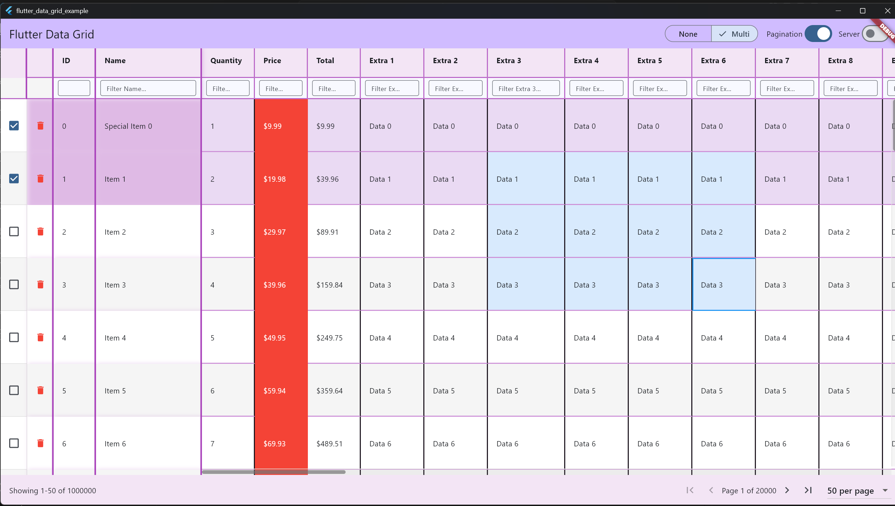

# Flutter Data Grid

A high-performance, reactive data grid for Flutter with comprehensive features including virtualization, sorting, filtering, cell editing, row selection, column pinning, and keyboard navigation.



> **Early Development - Beta**: This package is in active development. While core features are stable and well-tested, some advanced features are still being refined. APIs may evolve based on community feedback. See [Known Issues & Roadmap](#-known-issues--roadmap) below for current limitations.

## ✨ Features

### Core Functionality
- ✅ **Virtualized Rendering** - Only visible rows/columns rendered for smooth 60fps scrolling
- ✅ **Column Management** - Resize, pin, hide/show, reorder columns
- ✅ **Column Sorting** - Single-column sorting with ascending/descending/clear cycle
- ✅ **Column Filtering** - Customizable column filtering
- ✅ **Row Selection** - None/Single/Multiple modes with checkbox column
- ✅ **Cell Editing** - Inline editing with validation and callbacks
- ✅ **Pagination** - Client-side and server-side pagination with customizable page sizes
- ✅ **Theming** - Fully customizable appearance
- ✅ **Interceptors** - Logging, validation, custom event handling

### Performance
- **Isolate Processing** - Sorting and filtering run on background isolates for large datasets
- **Debouncing** - Configurable debounce for sort/filter operations
- **Efficient Updates** - Reactive state management with RxDart
- **O(1) Viewport** - Constant-time visibility calculations

## 📦 Installation

Add this to your package's `pubspec.yaml` file:

```yaml
dependencies:
  flutter_data_grid: ^0.0.11
```

Then run:

```bash
flutter pub get
```

Import the package in your Dart code:

```dart
import 'package:flutter_data_grid/data_grid.dart';
```

## ⚠️ Known Issues & Roadmap

This package is in active development. Core features work well, but some advanced features are still being refined:

### What Works Well ✅
- **Row selection** - Fully implemented with none/single/multiple modes
- **Virtualized rendering** - Smooth scrolling with 100k+ rows
- **Sorting & filtering** - Single-column sorting with background processing for large datasets
- **Column management** - Resize, pin, hide/show columns
- **Cell editing** - Inline editing with validation (some edge cases remain)
- **Pagination** - Client-side and server-side pagination with loading states
- **Theming** - Comprehensive customization options

### In Progress / Known Issues ⚠️
- **Keyboard navigation** - Arrow keys work but may have issues in some scenarios
- **Tab navigation** - Between cells needs improvement
- **Cell editing** - Edge cases with rapid interactions being addressed

### Planned Features 🚀
- **Cell selection** - Individual cell selection and ranges
- **Column selection** - Select entire columns
- **Accessibility** - Improved screen reader support and ARIA labels
- **Column reordering** - Drag-and-drop reordering
- **Context menus** - Right-click menus for rows/cells
- **Copy/paste** - Clipboard integration

### Production Use
This package is suitable for:
- ✅ Internal tools and dashboards
- ✅ Admin panels and data management UIs
- ✅ Projects willing to work around known limitations
- ✅ Applications that can test thoroughly for their use case

Consider waiting for v1.0 if you need:
- ❌ Full accessibility compliance
- ❌ Rock-solid keyboard navigation
- ❌ Complete feature parity with enterprise data grids

**Contributions welcome!** If you'd like to help improve any of these areas, please see the Contributing section.

## 🏗️ Architecture

```
┌─────────────────────────────────────────────────┐
│              DataGrid Widget                    │
│  ┌──────────────┐        ┌──────────────┐      │
│  │    Header    │        │  Scrollbars  │      │
│  └──────────────┘        └──────────────┘      │
│  ┌──────────────────────────────────────┐      │
│  │         Virtualized Body             │      │
│  │  (TwoDimensionalScrollView)          │      │
│  └──────────────────────────────────────┘      │
└────────────┬────────────────────────────────────┘
             │
    ┌────────▼────────┐
    │   Controller    │
    │    (RxDart)     │
    └────────┬────────┘
             │
    ┌────────▼────────────────────────┐
    │    Event-Driven Architecture    │
    │  • Data Events (CRUD)           │
    │  • Sort Events                  │
    │  • Filter Events                │
    │  • Selection Events             │
    │  • Edit Events                  │
    │  • Pagination Events            │
    │  • Scroll Events                │
    │  • Keyboard Events              │
    └─────────────────────────────────┘
```

## 📁 Project Structure

```
lib/
├── controllers/
│   ├── data_grid_controller.dart    # Main state controller
│   └── grid_scroll_controller.dart  # Scroll synchronization
│
├── models/
│   ├── data/
│   │   ├── column.dart              # Column configuration
│   │   └── row.dart                 # Row interface
│   ├── state/
│   │   └── grid_state.dart          # Freezed state models
│   ├── enums/
│   │   ├── filter_operator.dart     # Filter operators
│   │   ├── selection_mode.dart      # Selection modes
│   │   └── sort_direction.dart      # Sort directions
│   └── events/
│       ├── data_events.dart         # CRUD operations
│       ├── sort_events.dart         # Sorting
│       ├── filter_events.dart       # Filtering
│       ├── selection_events.dart    # Row/cell selection
│       ├── edit_events.dart         # Cell editing
│       ├── keyboard_events.dart     # Keyboard navigation
│       └── pagination_events.dart   # Pagination
│
├── delegates/
│   ├── sort_delegate.dart           # Pluggable sorting
│   ├── filter_delegate.dart         # Pluggable filtering
│   └── viewport_delegate.dart       # Viewport calculations
│
├── renderers/
│   ├── cell_renderer.dart           # Custom cell rendering
│   ├── row_renderer.dart            # Custom row rendering
│   └── filter_renderer.dart         # Custom filter widgets
│
├── interceptors/
│   ├── data_grid_interceptor.dart   # Base interceptor
│   ├── logging_interceptor.dart     # Event logging
│   └── validation_interceptor.dart  # Data validation
│
├── theme/
│   ├── data_grid_theme.dart         # Theme provider
│   └── data_grid_theme_data.dart    # Theme configuration
│
├── utils/
│   ├── data_indexer.dart            # Sort/filter operations
│   ├── isolate_sort.dart            # Background sorting
│   ├── isolate_filter.dart          # Background filtering
│   └── viewport_calculator.dart     # Virtualization math
│
├── widgets/
│   ├── data_grid.dart               # Main widget
│   ├── data_grid_header.dart        # Header row
│   ├── data_grid_body.dart          # Virtualized body
│   ├── data_grid_pagination.dart    # Pagination controls
│   ├── cells/
│   │   ├── data_grid_cell.dart      # Standard cell
│   │   ├── data_grid_header_cell.dart # Header cell
│   │   └── data_grid_checkbox_cell.dart # Selection checkbox
│   ├── overlays/
│   │   └── loading_overlay.dart     # Loading indicator
│   ├── scroll/
│   │   ├── scrollbar_horizontal.dart
│   │   └── scrollbar_vertical.dart
│   └── viewport/
│       ├── data_grid_viewport.dart  # TwoDimensionalScrollView
│       └── data_grid_header_viewport.dart  # Header/filter render object
│
└── data_grid.dart                   # Public API exports
```

## 🚀 Quick Start

### 1. Define Your Row Model

```dart
class Person extends DataGridRow {
  final String name;
  final int age;
  final String email;
  
  Person({required double id, required this.name, required this.age, required this.email}) {
    this.id = id;
  }
}
```

### 2. Create Columns

```dart
final columns = <DataGridColumn<Person>>[
  DataGridColumn<Person>(
    id: 1,
    title: 'Name',
    width: 200,
    valueAccessor: (row) => row.name,
    cellValueSetter: (row, value) => row.name = value,
    sortable: true,
    filterable: true,
    editable: true,
    pinned: false,
  ),
  DataGridColumn<Person>(
    id: 2,
    title: 'Age',
    width: 100,
    valueAccessor: (row) => row.age,
    cellValueSetter: (row, value) => row.age = value,
  ),
  DataGridColumn<Person>(
    id: 3,
    title: 'Email',
    width: 250,
    valueAccessor: (row) => row.email,
    validator: (oldValue, newValue) => newValue.contains('@'),
  ),
];
```

### 3. Create Controller

```dart
final controller = DataGridController<Person>(
  initialColumns: columns,
  initialRows: rows,
  rowHeight: 48.0,
  sortDebounce: Duration(milliseconds: 300),
  filterDebounce: Duration(milliseconds: 500),  // Default: 500ms
  sortIsolateThreshold: 10000,  // Use isolate for >10k rows
  filterIsolateThreshold: 10000,
);
```

### 4. Use the Widget

```dart
@override
Widget build(BuildContext context) {
  return Scaffold(
    body: DataGrid<Person>(
      controller: controller,
      headerHeight: 48.0,
      rowHeight: 48.0,
    ),
  );
}
```

## 📖 Detailed Usage

### Column Configuration

```dart
DataGridColumn<MyRow>(
  id: 1,                                  // Unique column identifier
  title: 'Column Title',                  // Header text
  width: 150,                             // Initial width
  pinned: false,                          // Pin to left
  visible: true,                          // Show/hide column
  resizable: true,                        // Allow resize
  sortable: true,                         // Enable sorting
  filterable: true,                       // Enable filtering
  editable: true,                         // Allow inline editing
  valueAccessor: (row) => row.value,      // Get cell value
  cellValueSetter: (row, val) => row.value = val,  // Set cell value
  validator: (old, new) => new != null,   // Validate edits
  cellRenderer: customRenderer,           // Custom rendering
  cellEditorBuilder: customEditor,        // Custom editor
  cellFormatter: (row, col) => 'text',    // Format display
)
```

### Data Operations

```dart
// Load data
controller.setRows(myRows);

// Insert rows
controller.insertRow(newRow);
controller.insertRow(newRow, position: 0);  // Insert at index
controller.insertRows([row1, row2, row3]);

// Update data
controller.updateRow(rowId, updatedRow);
controller.updateCell(rowId, columnId, newValue);

// Delete data
controller.deleteRow(rowId);
controller.deleteRows({id1, id2, id3});
```

### Sorting

```dart
// Sort by column (ascending)
controller.addEvent(SortEvent(
  columnId: 1,
  direction: SortDirection.ascending,
));

// Sort by column (descending)
controller.addEvent(SortEvent(
  columnId: 1,
  direction: SortDirection.descending,
));

// Clear sort
controller.addEvent(SortEvent(
  columnId: 1,
  direction: null,  // Clears the sort
));

// Note: Sorting a different column replaces the current sort
// Only single-column sorting is supported
```

### Filtering

```dart
// Apply filter
controller.addEvent(FilterEvent(
  columnId: 1,
  operator: FilterOperator.contains,
  value: 'search term',
));

// Available operators:
// - equals, notEquals
// - contains, startsWith, endsWith (case-insensitive, trims whitespace)
// - greaterThan, lessThan
// - greaterThanOrEqual, lessThanOrEqual
// - isEmpty, isNotEmpty

// String filters are sanitized:
// - Trimmed (leading/trailing whitespace removed)
// - Case-insensitive matching
// - Multiple spaces normalized to single space

// Clear filter
controller.addEvent(ClearFilterEvent(columnId: 1));  // Clear one
controller.addEvent(ClearFilterEvent());              // Clear all
```

### Selection

```dart
// Configure selection mode
controller.setSelectionMode(SelectionMode.none);      // Disabled
controller.setSelectionMode(SelectionMode.single);    // Single row
controller.setSelectionMode(SelectionMode.multiple);  // Multiple rows

// Or use helpers
controller.disableSelection();
controller.enableMultiSelect(true);

// Select rows
controller.addEvent(SelectRowEvent(rowId: 1));
controller.addEvent(SelectRowEvent(rowId: 2, multiSelect: true));

// Select range
controller.addEvent(SelectRowsRangeEvent(
  startRowId: 1,
  endRowId: 5,
));

// Select all visible
controller.addEvent(SelectAllVisibleEvent());

// Clear selection
controller.addEvent(ClearSelectionEvent());

// Listen to selection
controller.selection$.listen((selection) {
  print('Selected: ${selection.selectedRowIds}');
});
```

### Pagination

```dart
// Enable pagination
controller.enablePagination(true);

// Navigate pages
controller.setPage(5);           // Go to specific page
controller.nextPage();           // Next page
controller.previousPage();       // Previous page
controller.firstPage();          // First page
controller.lastPage();           // Last page

// Change page size
controller.setPageSize(25);      // 25 rows per page

// Disable pagination
controller.enablePagination(false);
```

#### Server-Side Pagination

For server-side pagination, provide callbacks when creating the controller:

```dart
final controller = DataGridController<MyRow>(
  initialColumns: columns,
  initialRows: [],  // Start empty for server-side
  onLoadPage: (page, pageSize) async {
    // Fetch data from your API
    final response = await api.fetchPage(page: page, limit: pageSize);
    return response.rows;
  },
  onGetTotalCount: () async {
    // Return total row count from server
    return await api.getTotalCount();
  },
);

// Enable server-side pagination
controller.enablePagination(true);
controller.setServerSidePagination(true);

// For server-side, you must set total items after loading
controller.setTotalItems(totalCount);
```

### Cell Editing

```dart
// Start editing
controller.startEditCell(rowId, columnId);

// Update value
controller.updateCellEditValue(newValue);

// Commit changes
controller.commitCellEdit();

// Cancel editing
controller.cancelCellEdit();

// With validation
final controller = DataGridController<MyRow>(
  columns: columns,
  rows: rows,
  canEditCell: (rowId, columnId) => rowId > 0,  // Custom permission
  onCellCommit: (rowId, columnId, oldValue, newValue) async {
    // Return true to allow, false to reject
    return await saveToDatabase(rowId, columnId, newValue);
  },
);
```

### Keyboard Navigation

Built-in keyboard shortcuts:
- **Arrow Up/Down**: Navigate rows
- **Arrow Left/Right**: Navigate columns  
- **Escape**: Clear selection
- **Ctrl+A / Cmd+A**: Select all visible rows

### Custom Rendering

```dart
// Custom cell renderer
class MyRenderer implements CellRenderer<MyRow> {
  @override
  Widget buildCell(RenderContext<MyRow> context) {
    return Container(
      color: context.row.value > 100 ? Colors.green : Colors.red,
      child: Text(context.value.toString()),
    );
  }
}

DataGrid<MyRow>(
  controller: controller,
  cellRenderer: MyRenderer(),
)
```

### Theming

```dart
DataGrid<MyRow>(
  controller: controller,
  theme: DataGridThemeData(
    colors: DataGridColors(
      headerBackground: Colors.blue,
      cellBackground: Colors.white,
      selectedRow: Colors.blue.shade100,
      gridLines: Colors.grey.shade300,
    ),
    dimensions: DataGridDimensions(
      headerHeight: 48,
      rowHeight: 40,
      columnMinWidth: 50,
    ),
    typography: DataGridTypography(
      headerTextStyle: TextStyle(fontWeight: FontWeight.bold),
      cellTextStyle: TextStyle(fontSize: 14),
    ),
  ),
)
```

### Interceptors

```dart
// Logging interceptor
controller.addInterceptor(LoggingInterceptor<MyRow>());

// Validation interceptor  
controller.addInterceptor(ValidationInterceptor<MyRow>(
  validators: {
    'age': (value) => value >= 0 && value <= 150,
  },
));

// Custom interceptor
class MyInterceptor extends DataGridInterceptor<MyRow> {
  @override
  DataGridEvent? onBeforeEvent(DataGridEvent event, DataGridState<MyRow> state) {
    // Modify or cancel events
    return event;
  }
  
  @override
  DataGridState<MyRow>? onBeforeStateUpdate(
    DataGridState<MyRow> newState,
    DataGridState<MyRow> oldState,
    DataGridEvent? event,
  ) {
    // Modify state before update
    return newState;
  }
  
  @override
  void onAfterStateUpdate(
    DataGridState<MyRow> newState,
    DataGridState<MyRow> oldState,
    DataGridEvent? event,
  ) {
    // React to state changes
  }
}
```

### Custom Events

You can create custom events to extend the grid's functionality:

```dart
// 1. Define your custom event
class ExportToCSVEvent extends DataGridEvent {
  final String filename;
  
  ExportToCSVEvent({required this.filename});
  
  @override
  DataGridState<T>? apply<T extends DataGridRow>(EventContext<T> context) {
    // Access current state
    final rows = context.state.visibleRows;
    final columns = context.state.columns;
    
    // Perform your custom logic
    _exportToCSV(rows, columns, filename);
    
    // Return null if no state change needed
    // Or return modified state if needed
    return null;
  }
  
  void _exportToCSV(List rows, List columns, String filename) {
    // Your export logic here
    print('Exporting ${rows.length} rows to $filename');
  }
}

// 2. Dispatch your custom event
controller.addEvent(ExportToCSVEvent(filename: 'data.csv'));

// 3. More complex example with state changes
class HighlightRowsAboveThresholdEvent extends DataGridEvent {
  final int threshold;
  
  HighlightRowsAboveThresholdEvent(this.threshold);
  
  @override
  DataGridState<T>? apply<T extends DataGridRow>(EventContext<T> context) {
    // Find rows that meet criteria
    final highlightedIds = <double>{};
    for (final row in context.state.visibleRows) {
      // Assuming row has a 'value' property
      if ((row as dynamic).value > threshold) {
        highlightedIds.add(row.id);
      }
    }
    
    // Update selection to highlight these rows
    return context.state.copyWith(
      selection: context.state.selection.copyWith(
        selectedRowIds: highlightedIds,
      ),
    );
  }
}

// Usage
controller.addEvent(HighlightRowsAboveThresholdEvent(100));

// 4. Async custom event example
class FetchAndAppendDataEvent extends DataGridEvent {
  final String apiEndpoint;
  
  FetchAndAppendDataEvent(this.apiEndpoint);
  
  @override
  bool shouldShowLoading(DataGridState state) => true;
  
  @override
  String? loadingMessage() => 'Fetching data from API...';
  
  @override
  Future<DataGridState<T>?> apply<T extends DataGridRow>(EventContext<T> context) async {
    try {
      // Fetch data from API
      final newRows = await _fetchFromAPI(apiEndpoint);
      
      // Append to existing data
      final updatedRowsById = Map<double, T>.from(context.state.rowsById);
      for (final row in newRows) {
        updatedRowsById[row.id] = row as T;
      }
      
      final updatedDisplayOrder = [
        ...context.state.displayOrder,
        ...newRows.map((r) => r.id),
      ];
      
      return context.state.copyWith(
        rowsById: updatedRowsById,
        displayOrder: updatedDisplayOrder,
        isLoading: false,
      );
    } catch (e) {
      print('Error fetching data: $e');
      return context.state.copyWith(isLoading: false);
    }
  }
  
  Future<List<DataGridRow>> _fetchFromAPI(String endpoint) async {
    // Your API call here
    await Future.delayed(Duration(seconds: 2));
    return [];
  }
}

// Usage
controller.addEvent(FetchAndAppendDataEvent('https://api.example.com/data'));
```

### Delegates (Advanced)

```dart
// Custom sort delegate
class MySortDelegate extends SortDelegate<MyRow> {
  @override
  Future<SortResult?> handleSort(
    SortEvent event,
    DataGridState<MyRow> state,
    void Function(SortResult) onComplete,
  ) async {
    // Custom sorting logic
  }
}

final controller = DataGridController<MyRow>(
  columns: columns,
  rows: rows,
  sortDelegate: MySortDelegate(),
  filterDelegate: MyFilterDelegate(),
  viewportDelegate: MyViewportDelegate(),
);
```

## 🎯 Performance Tips

1. **Use isolate thresholds wisely**: Default 10,000 rows works well for most cases
2. **Set appropriate debounce**: 500ms for filters (default), 300ms for sort
3. **Implement valueAccessor efficiently**: Avoid heavy computations
4. **Use pinned columns sparingly**: Too many pinned columns affect performance
5. **Dispose controllers**: Always call `controller.dispose()` in `State.dispose()`

### Web / Chrome Performance

**Debug mode on Chrome (without `--release` or `--wasm`) will have poor performance.** This is expected — Flutter's debug mode includes extra assertions, disables optimizations, and the Dart-to-JS compilation is unoptimized. The data grid automatically caps `cacheExtent` to 500px in debug builds to mitigate this, but scrolling will still feel sluggish compared to release builds.

For accurate performance testing on the web, always use one of:

```bash
# Release mode (recommended for testing)
flutter run -d chrome --release

# WebAssembly (best performance)
flutter run -d chrome --wasm
```

## 📊 Performance Benchmarks

- **100,000 rows**: Smooth 60fps scrolling
- **Initial render**: <100ms
- **Sorting**: Non-blocking with isolate (background thread)
- **Selection**: <16ms (instant feedback)
- **Column resize**: Instant visual feedback

## 🧪 Testing

Comprehensive test suite included:
- Widget tests for all major features (128 passing tests)
- State management tests
- Selection mode tests
- Edit workflow tests
- Keyboard navigation tests

Run tests:
```bash
flutter test
```

## 📝 Event Reference

### Data Events
- `LoadDataEvent` - Load rows
- `InsertRowEvent` / `InsertRowsEvent` - Add rows
- `DeleteRowEvent` / `DeleteRowsEvent` - Remove rows
- `UpdateRowEvent` / `UpdateCellEvent` - Modify data

### Sort Events
- `SortEvent` - Apply/modify sort
- `SortCompleteEvent` - Sort finished (internal)

### Filter Events
- `FilterEvent` - Apply filter
- `ClearFilterEvent` - Remove filters

### Selection Events
- `SelectRowEvent` - Select row
- `SelectRowsRangeEvent` - Select range
- `SelectAllRowsEvent` / `SelectAllVisibleEvent` - Select all
- `ClearSelectionEvent` - Clear selection
- `SetSelectionModeEvent` - Change mode

### Edit Events
- `StartCellEditEvent` - Begin editing
- `UpdateCellEditValueEvent` - Update value
- `CommitCellEditEvent` - Save changes
- `CancelCellEditEvent` - Discard changes

### Pagination Events
- `EnablePaginationEvent` - Enable/disable pagination
- `SetServerSidePaginationEvent` - Toggle server-side mode
- `SetPageEvent` - Go to specific page
- `SetPageSizeEvent` - Change rows per page
- `NextPageEvent` / `PreviousPageEvent` - Navigate pages
- `FirstPageEvent` / `LastPageEvent` - Jump to start/end
- `SetTotalItemsEvent` - Set total count (server-side)

### Keyboard Events
- `NavigateUpEvent` / `NavigateDownEvent` - Move selection
- `NavigateLeftEvent` / `NavigateRightEvent` - Navigate columns

### Column Events
- `ColumnResizeEvent` - Resize column
- `SetColumnWidthEvent` - Set exact width

### Scroll Events
- `ScrollEvent` - Scroll viewport
- `ViewportResizeEvent` - Viewport size changed

## 🔧 Troubleshooting

**Q: Blank cells while scrolling?**  
A: This is normal virtualization behavior. Cells render as they become visible.

**Q: Sorting/filtering not working in tests?**  
A: Use `sortDebounce: Duration.zero` and `filterDebounce: Duration.zero` for tests.
Also use `await tester.runAsync(() => Future.delayed(Duration(milliseconds: 50)))` before assertions to allow async stream operations to complete.

**Q: Selection not working?**  
A: Ensure `SelectionMode` is not set to `none`.

**Q: Column resize not persisting?**  
A: Column widths are in-memory. Persist to storage if needed.

**Q: Build errors after changes?**  
A: Run: `dart run build_runner build --delete-conflicting-outputs`

## 📚 Dependencies

```yaml
dependencies:
  flutter:
    sdk: flutter
  rxdart: ^0.28.0
  collection: ^1.18.0
  freezed_annotation: ^2.4.4

dev_dependencies:
  build_runner: ^2.4.12
  freezed: ^2.5.7
```

## 🚧 Roadmap & Future Enhancements

### High Priority (Addressing Limitations)
- [ ] **Cell selection** - Individual cell selection and ranges
- [ ] **Improved keyboard navigation** - Reliable arrow key navigation and Tab support
- [ ] **Accessibility improvements** - Screen reader support, ARIA labels, focus management
- [ ] **Column reordering** - Drag-and-drop column reordering
- [ ] **Stable cell editing** - Fix edge cases and improve UX

### Medium Priority
- [ ] **Context menus** - Right-click menus for rows/cells/headers
- [ ] **Copy/paste** - Clipboard integration
- [ ] **Row grouping UI** - Visual grouping with expand/collapse
- [x] **Pagination** - Built-in pagination controls (added in v0.0.3)
- [ ] **Export functionality** - CSV/Excel export
- [ ] **Column auto-sizing** - Fit content or fit header
- [ ] **Frozen rows** - Pin rows to top/bottom

### Low Priority
- [x] **Header viewport optimization** - Custom RenderObject for header/filter scrolling (no widget rebuilds)
- [ ] **Advanced layout logic** - More flexible positioning and z-ordering for overlays
- [ ] **Touch gestures** - Swipe actions, pinch-to-zoom
- [ ] **Undo/redo** - Action history
- [ ] **Advanced filtering UI** - Filter builder with AND/OR logic
- [ ] **Conditional formatting** - Rule-based cell styling

## 👥 Contributing

Contributions are welcome! This is an experimental project and could benefit from community input.

### Areas Needing Help
1. **Accessibility** - Making the grid work with screen readers
2. **Keyboard Navigation** - Improving reliability and coverage
3. **Cell Selection** - Implementing individual cell selection
4. **Testing** - Adding more test coverage
5. **Documentation** - Improving examples and API docs
6. **Performance** - Optimizing for even larger datasets

### How to Contribute
1. Fork the repository
2. Create a feature branch (`git checkout -b feature/amazing-feature`)
3. Make your changes
4. Add tests if applicable
5. Run tests: `flutter test`
6. Commit your changes (`git commit -m 'Add amazing feature'`)
7. Push to the branch (`git push origin feature/amazing-feature`)
8. Open a Pull Request

### Development Setup
```bash
# Clone the repo
git clone https://github.com/archie934/data_grid.git
cd data_grid

# Install dependencies
flutter pub get

# Run code generation (for Freezed models)
dart run build_runner build --delete-conflicting-outputs

# Run tests
flutter test

# Run the example app
cd example
flutter pub get
flutter run
```

## 📄 License

See LICENSE file.

## 🙏 Acknowledgments

- Built with Flutter's **TwoDimensionalScrollView** for efficient virtualization
- Uses **RxDart** for reactive state management
- Uses **Freezed** for immutable state models
- Inspired by data grid implementations in AG Grid, Handsontable, and Excel


**Built with Flutter 💙**
